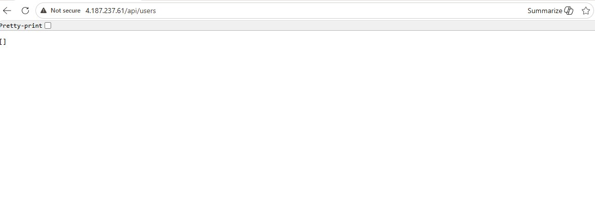
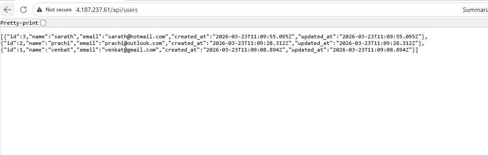
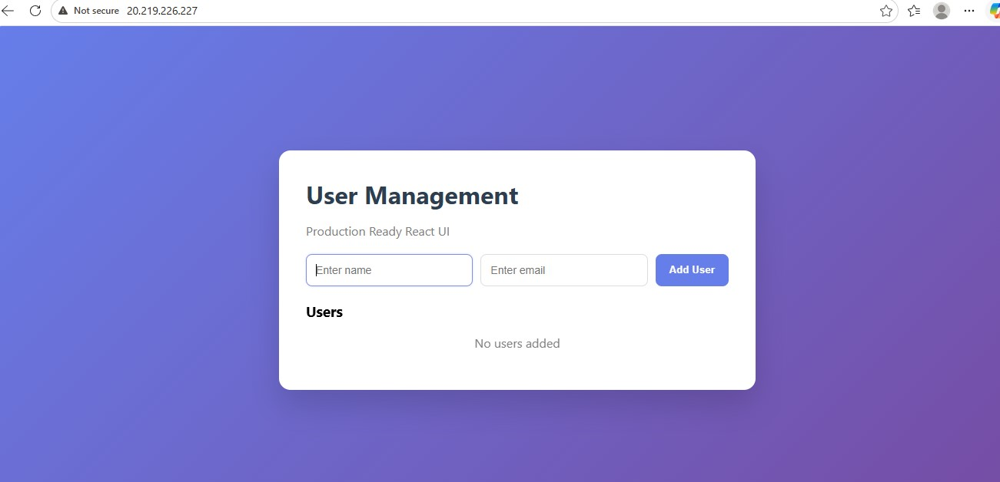
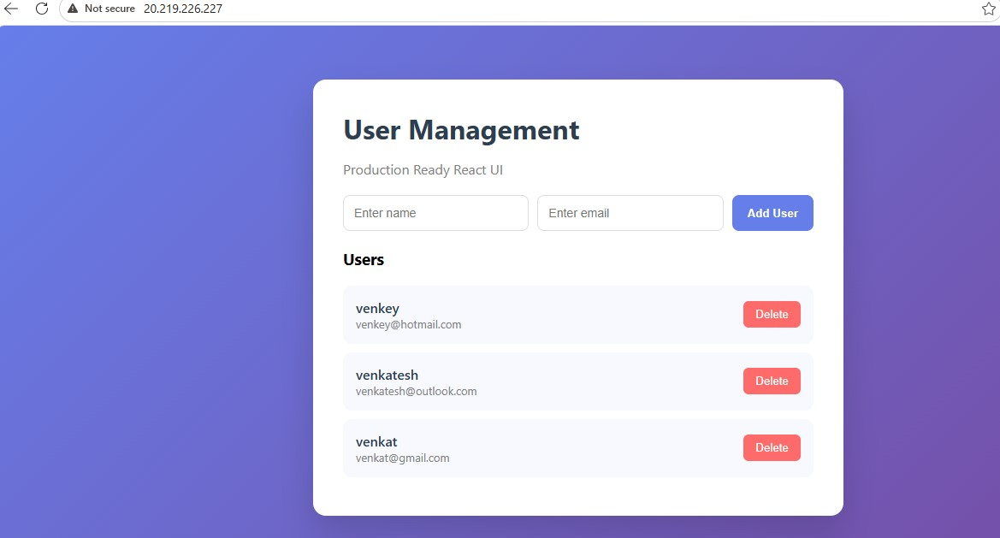

# Full‑Stack user management Application with CI/CD using Github actions

A full‑stack web application with **backend API**, **frontend UI**, and **PostgreSQL database**, deployed to **Kubernetes on Azure AKS** using an automated GitHub Actions pipeline with Docker and Terraform.

## Overview

This repo contains:
- `backend/` – Backend API (Node.js / Python / Go, etc.)
- `frontend/` – Frontend application (React / Vue / Angular)
- `database/` – Database schema and migrations
- `Infra/` – Terraform scripts to provision Azure resources (AKS, ACR, networking)
- `k8s/` – Kubernetes manifests for deployments, services, and ingress
- `.github/workflows/` – CI/CD pipeline for build, push, and deploy

The pipeline:
- Builds and pushes Docker images to **Docker Hub** on relevant changes.
- Applies **Terraform** to manage Azure infrastructure.
- Deploys the application to **Azure Kubernetes Service (AKS)** using `kubectl`.

---

## Architecture

- Backend: exposed via Kubernetes `Service` and `Ingress`
- Frontend: served via Kubernetes, routed through NGINX Ingress
- PostgreSQL: deployed as a Kubernetes `Deployment` with `ConfigMap` and `Service`
- CI/CD: GitHub Actions on `push` to `main`, with conditional runs based on file changes

---

## Key Files

| Directory / File | Purpose |
|------------------|---------|
| `backend/` | Backend API code |
| `frontend/` | Frontend SPA code |
| `database/` | SQL scripts, migrations |
| `Dockerfile` | Multi‑stage Docker build for backend/frontend |
| `Infra/terraform.tfvars` | Terraform variables for Azure resources |
| `Infra/main.tf`, `Infra/aks.tf` | Terraform config for AKS and infra |
| `k8s/namespace.yaml` | Kubernetes application namespace |
| `k8s/postgres-*.yaml` | PostgreSQL deployment, service, and config |
| `k8s/backend-*.yaml` | Backend deployment and service |
| `k8s/frontend-*.yaml` | Frontend deployment and service |
| `k8s/ingress.yaml` | Ingress routing for backend/frontend |

---

## CI/CD Pipeline

The GitHub Actions workflow:

1. **`changes` job**  
   - Filters changes using `dorny/paths-filter`.  
   - Triggers CI only when files under `backend/**`, `frontend/**`, `database/**`, or `Dockerfile` change.

2. **`build-and-push` job**  
   - Checks out the code.
   - Logs into **Docker Hub** using `secrets.DOCKER_USERNAME` and `secrets.DOCKER_PASSWORD`.
   - Builds:
     - `backend:latest` image from `./backend`
     - `frontend:latest` image from `./frontend`
   - Pushes both images to Docker Hub.

3. **`terraform` job**  
   - Runs after `build-and-push`.
   - Logs into **Azure** using `secrets.AZURE_CREDENTIALS`.
   - Uses `hashicorp/setup-terraform@v3`.
   - Runs `terraform init`, `terraform plan`, and `terraform apply -auto-approve` inside `Infra/`.

4. **`deploy-kubernetes` job**  
   - Runs after Terraform completes.
   - Logs into Azure and AKS using `az aks get-credentials`.
   - Waits for cluster readiness.
   - Installs NGINX Ingress (if not present).
   - Applies all manifests in the `k8s/` directory.

---

## Secrets and Variables

In GitHub, you must set these **secrets**:

- `DOCKER_USERNAME` – Docker Hub username
- `DOCKER_PASSWORD` – Docker Hub password or access token
- `AZURE_CREDENTIALS` – Azure Service Principal JSON for AKS access
     {
        "clientSecret":  "your-secret-id",
        "subscriptionId":  "your-sub-id",
        "tenantId":  "your-tenant-id",
        "clientId":  "your-clinet-id"
     }

In GitHub **Repository Variables** (or workflow):

- `RG_NAME` – Azure Resource Group name
- `AKS_NAME` – AKS cluster name

---

## How to Run Locally

### 1. Clone the repo

```bash
git clone <your-repo-url>
cd <project-name>
```
### 2. Backend (Node.js)

```bash
# Navigate to your frontend directory
cd backend

# Open or create the .env file
nano .env

# Add the following lines inside .env
DB_HOST=postgres  # Use container name in Docker, or localhost for local dev
DB_USER=postgres
DB_PASSWORD=postgres
DB_NAME=usersdb
DB_PORT=5432
PORT=5000

Notes:
- "DB_HOST is the PostgreSQL hostname. If using Docker, it’s the container name (postgres)." 
- "Incase if you are using local. it's the container name is (localhost)."
- "PORT is where your backend server listens."
```
```bash
npm install
npm start
```
### 3. Frontend (React)

```bash
# Navigate to your frontend directory
cd frontend

# Open or create the .env file
nano .env

# Add the following lines inside .env
REACT_APP_API=http://0.0.0.0:5000
HOST=0.0.0.0
DANGEROUSLY_DISABLE_HOST_CHECK=true

Notes:
- "For local dev, you can use http://localhost:5000."
- "If you later deploy to AKS or another server, replace it with the backend service URL."
- "DANGEROUSLY_DISABLE_HOST_CHECK=true is only recommended for local development; avoid using it in production."
```
```bash
npm install
npm start
```
### 4. Database Auto Table Creation (SQL in backend)

- Include this snippet in server.js before your routes:

```bash
      CREATE TABLE IF NOT EXISTS users(
        id SERIAL PRIMARY KEY,
        name VARCHAR(100) NOT NULL,
        email VARCHAR(150) UNIQUE NOT NULL,
        created_at TIMESTAMP DEFAULT CURRENT_TIMESTAMP,
        updated_at TIMESTAMP DEFAULT CURRENT_TIMESTAMP
      );

      CREATE INDEX IF NOT EXISTS idx_users_email
      ON users(email);

);

- This ensures the users table is automatically created when the backend starts.
- No manual SQL commands needed.
```

### 5. Database (example PostgreSQL)

```bash
   docker run -d \
   --name postgres-db \
   -e POSTGRES_USER=postgres \
   -e POSTGRES_PASSWORD=postgres \
   -e POSTGRES_DB=usersdb \
   -p 5432:5432 \
   postgres:15

- Backend .env must have DB_HOST=postgres when using Docker network.
- Frontend .env uses relative path or http://0.0.0.0:5000.
```  
### 6. check url for backend

```bash
http://localhost:5000/api/users
```

### 7. check url for frontend

```bash
http://localhost:3000
```
## Deploying to Kubernetes via Github Actions (via CI/CD)

### Deployment happens automatically when:

    - You push to the main branch, and

    - Changes are detected in backend/**, frontend/**, database/**, or Dockerfile.

### What happens in the pipeline:
    - New Docker images are built and pushed.
    - Terraform updates the Azure infrastructure (AKS, networking, etc.).
    - Kubernetes manifests in k8s/ are applied to AKS.
    - NGINX Ingress routes traffic to backend and frontend.

### To trigger a deployment:

```bash
# Make changes, then push
git add .
git commit -m "Update backend and frontend"
git push origin main
```
Then view the GitHub Actions workflow runs to see status.

## How to Check Status in Kubernetes
### After deployment, from your local machine:

```bash
az aks get-credentials \
  --resource-group $RG_NAME \
  --name $AKS_NAME \
  --overwrite-existing


kubectl get pods -n <namespace>
kubectl get services -n <namespace>
kubectl get ingress -n <namespace>
kubectl logs -f deployment/backend -n <namespace>
```
## check the all Kubernetes Resources Running (pods,services and ingress)


### backend API and backend DB
```bash
http://<<ingress-ip>>/api/users
```



### frontend UI and frontend add users
```bash
http://<<ingress-ip>>
```



## Contribution and Usage
    - If you want to contribute: open an issue or PR describing the change.
    - If you want to fork or reuse: follow the license (see below).
    - If you want to customize deployment: adjust the Terraform configs in Infra/  and Kubernetes manifests in k8s/.

📄 License
This project is licensed under the MIT License. See the LICENSE file for details.
MIT License [web:1][web:6]

text

***

### How to place this in your repo

1. In your repo root, create or edit: `README.md`  
2. Paste the above content.  
3. Replace placeholder text (tech stack, repo name, license file path, etc.) with your actual values.

